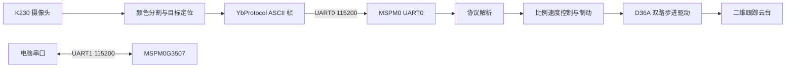

# K230 视觉跟踪二维云台

基于 K230 视觉模块、TI MSPM0G3507 和二维步进云台的视觉跟踪教学 Demo。

K230 负责识别橙色球并输出目标位置，通过 UART 将目标坐标发送给
MSPM0G3507；MSPM0 根据目标与画面中心的误差计算两轴转速，驱动云台持续
跟随目标。项目包含视觉端脚本、MSPM0 固件、串口协议、硬件接线和完整的
联调记录。

## 当前状态

- K230 颜色识别和目标定位已实机验证。
- K230 到 MSPM0 的 UART 通信稳定。
- MSPM0 双轴连续速度控制和方向映射已实机验证。
- K230 板载按键可以开始或停止跟踪。
- 目标丢失、按键停止和软件限位保护已经接入。
- 快速移动后急停仍可能存在少量过冲，属于后续调优项。

## 系统架构



## 核心功能

- 在 K230 上通过 HSV 阈值、形态学处理和轮廓筛选识别橙色球。
- 以约 25 Hz 的频率发送目标位置，坐标格式为 `x/y/w/h`。
- MSPM0 使用连续速度模式控制 A/B 两轴，控制周期为 40 ms。
- 使用中心死区、速度斜率限制和误差变化率前瞻降低抖动与过冲。
- 提供 UART 调试命令：`A+`、`A-`、`B+`、`B-`、`STOP`、`TRACK`、
  `ZERO`、`RX?`、`POS?`。
- 目标丢失超过 200 ms 后自动停止，并保留正负 90 度软件限位。

## 硬件组成

| 模块 | 型号或说明 |
|---|---|
| 视觉模块 | 亚博智能 K230 豪华版 |
| 主控 | TI MSPM0G3507 |
| 步进驱动 | WHEELTEC D36A 双路驱动器 |
| 云台 | WHEELTEC 二维步进云台 |
| 跟踪目标 | 橙色球 |

## 软件结构

```text
.
|-- k230_tracking_ball_uart.py    # K230 识别、显示、UART 发送和按键控制
|-- k230_uart_link_test.py        # 不依赖摄像头的最小链路测试
|-- tracking_gimbal/
|   |-- empty.c                   # MSPM0 初始化和主循环
|   |-- empty.syscfg              # UART、GPIO 和定时器配置
|   |-- App/                      # 跟踪控制、串口和应用协议
|   `-- Hardware/                 # 电机、按键、LED 和板级驱动
`-- *.md                          # 项目计划、交接、优化和结项记录
```

## 快速开始

### MSPM0

1. 使用 TI Code Composer Studio 打开 `tracking_gimbal` 工程。
2. 根据 [MSPM0 工程说明](tracking_gimbal/README.md) 检查接线和串口配置。
3. 编译并烧录固件。

### K230

1. 使用 CanMV IDE 打开 `k230_tracking_ball_uart.py`。
2. 第一次联调可先运行 `k230_uart_link_test.py` 验证串口链路。
3. 保存视觉脚本为 K230 的 `main.py` 后重新上电。
4. 短按 K230 板载按键，开始自动跟踪。

## 数据链路

目标位置帧：

```text
$23,01,020,030,040,050#
```

字段依次为整帧长度、功能 ID、目标左上角 `x/y` 和宽高 `w/h`。

按键控制帧：

```text
$09,24,1#    # 开始跟踪
$09,24,2#    # 停止跟踪
```

## 项目文档

- [结项交接记录](PROJECT_CLOSEOUT_HANDOFF.md)
- [项目开发记录](PROJECT_HANDOFF.md)
- [速度和平滑性优化记录](OPTIMIZATION_HANDOFF.md)
- [总体实现计划](TRACKING_GIMBAL_PLAN.md)
- [K230 学习路线](K230_STUDY_PATH.md)

## 已知限制

- 当前为开环步进控制，没有编码器、限位开关和自动回零。
- `POS?` 返回的是 STEP 脉冲估计位置，不是机械真实角度。
- 颜色阈值对灯光、背景和曝光变化较敏感。
- 快速目标急停时的过冲仍需要继续调参。
- D36A 细分设置必须与固件中的步数配置保持一致。
